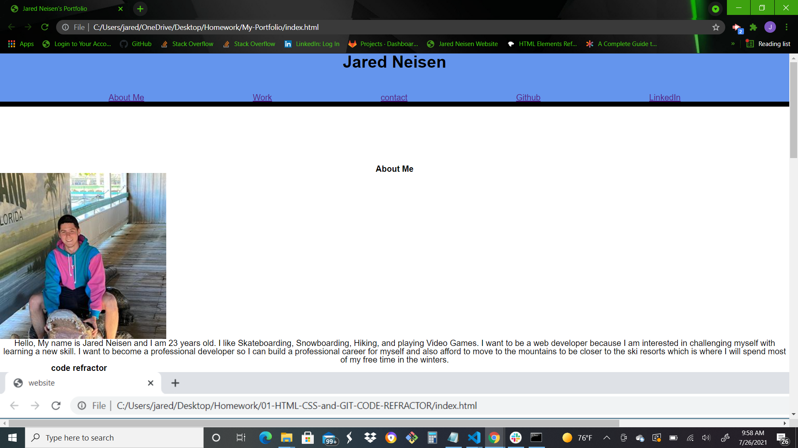
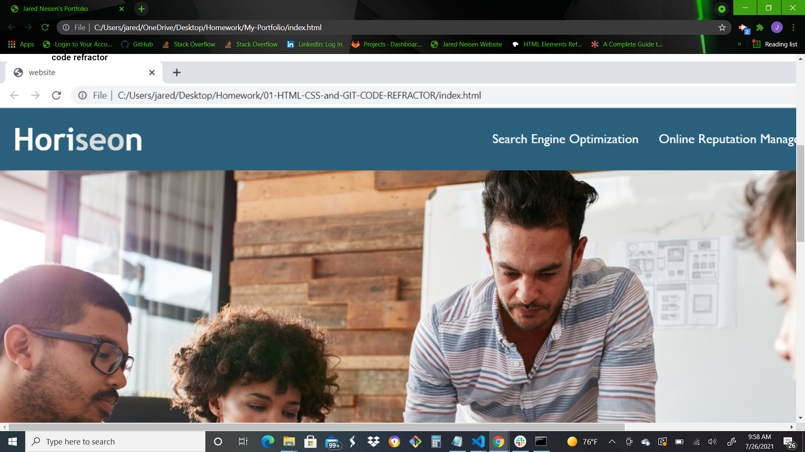
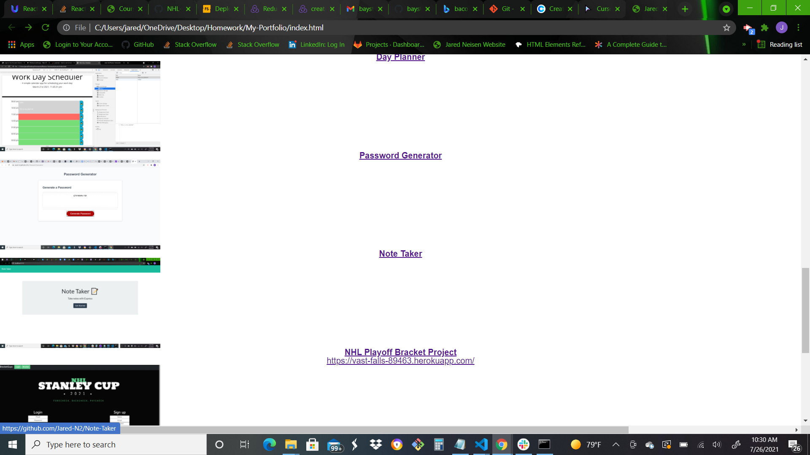
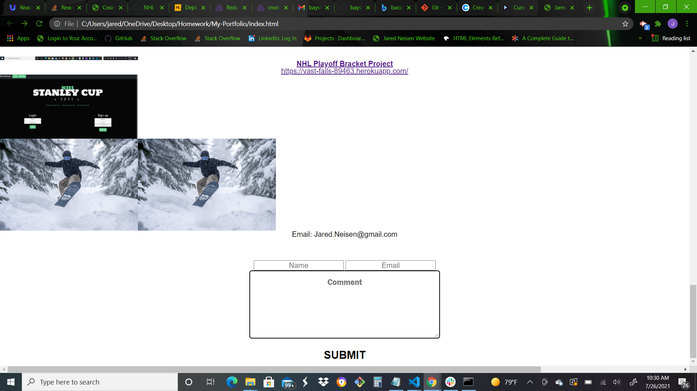

# My-Portfolio
The point of this homework was to create a portfolio webpage. The requirements were to state the developer's name, a recent photo, and links to sections about them, their work, and how to contact them. I also needed to have clickable links in my header that linked to sections in the page. The developers first application should be bigger than the others.
when you click the images, it takes you to that deployed application.

## What I did
For this homework, I started writing my HMTL from the ground up and made a header and separate sections to hold my content. I also added a footer with a contact section so people can reach me. I made sure my nav links in the header worked and linked to where they needed. I also linked my first work to the picture in the middle. I have no clue about what else I can do for my CSS because I have done a ton of different styling and Nothing seems to have worked so I will go back in and work on that at a later point, but I wanted to make sure the fuctions would still work.
Most recently, I added smoe pictures and links to other things I have worked on! I also added stuff from my project 2. 😊

## What it looks like

